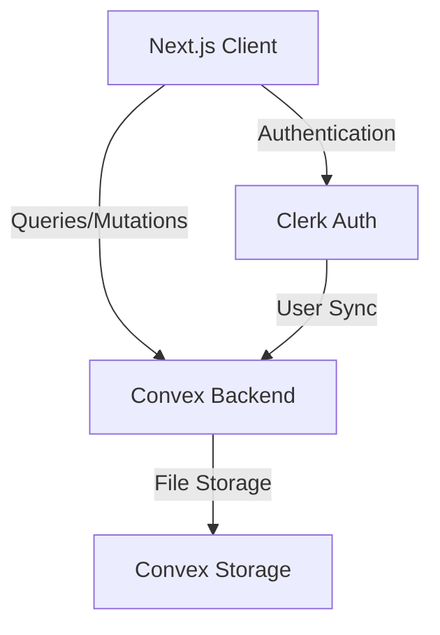
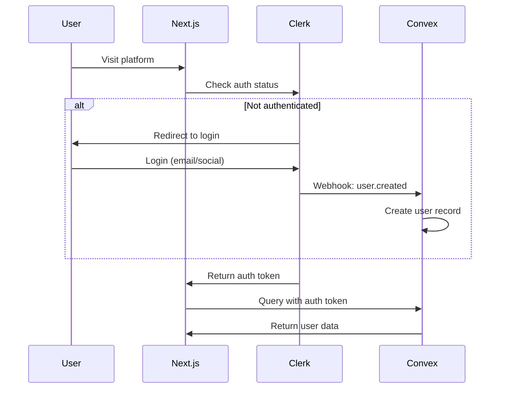
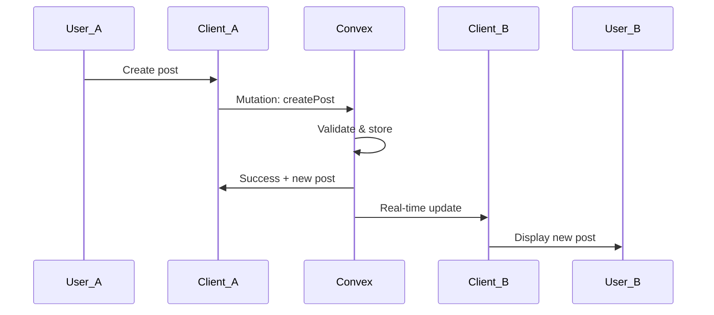

# Design Document: Campus Connect Foundation

## Overview

Campus Connect is a real-time academic social platform built with Next.js 14, Convex, and Clerk. This design document outlines the architecture, components, data models, and testing strategy for the foundation feature that establishes core functionality including authentication, user profiles, posts, and social interactions.

The platform leverages modern web technologies to provide a responsive, real-time experience:
- **Next.js 14 App Router** for server-side rendering and optimal performance
- **Convex** for real-time database with automatic synchronization
- **Clerk** for secure authentication with social login support
- **Tailwind CSS + shadcn/ui** for consistent, accessible UI components

## Architecture

### High-Level Architecture



### Application Structure

```
campus-connect/
├── app/                          # Next.js 14 App Router
│   ├── (auth)/                   # Auth routes (login, signup)
│   ├── (dashboard)/              # Protected routes
│   │   ├── feed/                 # Main feed page
│   │   ├── profile/[id]/         # User profile pages
│   │   ├── discover/             # User discovery
│   │   └── settings/             # User settings
│   ├── layout.tsx                # Root layout with providers
│   └── page.tsx                  # Landing page
├── components/                   # React components
│   ├── ui/                       # shadcn/ui components
│   ├── auth/                     # Auth-related components
│   ├── posts/                    # Post components
│   ├── profile/                  # Profile components
│   └── feed/                     # Feed components
├── convex/                       # Convex backend
│   ├── schema.ts                 # Database schema
│   ├── users.ts                  # User queries/mutations
│   ├── posts.ts                  # Post queries/mutations
│   ├── comments.ts               # Comment queries/mutations
│   ├── follows.ts                # Follow queries/mutations
│   └── http.ts                   # Clerk webhook handler
├── lib/                          # Utility functions
│   ├── utils.ts                  # General utilities
│   └── validations.ts            # Input validation schemas
└── hooks/                        # Custom React hooks
    ├── use-user.ts               # Current user hook
    └── use-theme.ts              # Theme management hook
```

### Authentication Flow



### Real-time Data Flow



## Components and Interfaces

### Frontend Components

#### Authentication Components

**SignInButton / SignUpButton**
- Purpose: Trigger Clerk authentication flows
- Props: None (uses Clerk components)
- Behavior: Opens Clerk modal for authentication

**UserButton**
- Purpose: Display user menu with profile and logout
- Props: None (uses Clerk component)
- Behavior: Shows avatar, opens menu on click

#### Profile Components

**ProfileForm**
- Purpose: Edit user profile information
- Props:
  - `initialData`: Current user profile data
  - `onSave`: Callback after successful save
- State: Form fields (name, bio, university, role, experienceLevel, socialLinks)
- Behavior: Validates input, calls Convex mutation on submit

**ProfileHeader**
- Purpose: Display user profile header with avatar and stats
- Props:
  - `user`: User object with profile data
  - `isOwnProfile`: Boolean indicating if viewing own profile
- Behavior: Shows follow button if not own profile

**SkillsManager**
- Purpose: Add/remove skills from profile
- Props:
  - `skills`: Array of current skills
  - `onUpdate`: Callback when skills change
- State: Input value for new skill
- Behavior: Validates skill input, prevents duplicates

#### Post Components

**PostComposer**
- Purpose: Create new posts
- Props:
  - `onPostCreated`: Callback after post creation
- State: Post content, character count
- Behavior: Validates content length, calls Convex mutation

**PostCard**
- Purpose: Display individual post with engagement options
- Props:
  - `post`: Post object with content and metadata
  - `author`: User object of post author
- Behavior: Shows like/comment buttons, handles engagement actions

**CommentList**
- Purpose: Display comments on a post
- Props:
  - `postId`: ID of the post
  - `comments`: Array of comment objects
- Behavior: Renders comments chronologically

**CommentComposer**
- Purpose: Add comments to posts
- Props:
  - `postId`: ID of the post to comment on
  - `onCommentAdded`: Callback after comment creation
- State: Comment text
- Behavior: Validates input, calls Convex mutation

#### Feed Components

**FeedContainer**
- Purpose: Display feed with infinite scroll
- Props: None (fetches data internally)
- State: Posts array, loading state, hasMore flag
- Behavior: Loads initial posts, fetches more on scroll

**InfiniteScrollTrigger**
- Purpose: Detect when user scrolls to bottom
- Props:
  - `onTrigger`: Callback when bottom reached
  - `hasMore`: Boolean indicating if more data available
- Behavior: Uses Intersection Observer API

#### Discovery Components

**UserSearchBar**
- Purpose: Search users by name
- Props:
  - `onSearch`: Callback with search query
- State: Search input value
- Behavior: Debounces input, triggers search

**UserFilterPanel**
- Purpose: Filter users by role and skills
- Props:
  - `onFilterChange`: Callback with filter criteria
- State: Selected role, selected skills
- Behavior: Updates filters, triggers search

**UserCard**
- Purpose: Display user in search results
- Props:
  - `user`: User object
- Behavior: Shows profile preview, links to full profile

### Backend Components (Convex)

#### Schema Definitions

**users table**
```typescript
{
  clerkId: string (indexed)
  email: string
  name: string
  profilePicture?: string
  bio?: string
  university?: string
  role: "Student" | "Research Scholar" | "Faculty"
  experienceLevel: "Beginner" | "Intermediate" | "Advanced" | "Expert"
  skills: string[]
  socialLinks: {
    github?: string
    linkedin?: string
    twitter?: string
    website?: string
  }
  followerCount: number
  followingCount: number
  createdAt: number
  updatedAt: number
}
```

**posts table**
```typescript
{
  authorId: Id<"users">
  content: string
  likeCount: number
  commentCount: number
  createdAt: number
  updatedAt: number
}
```

**likes table**
```typescript
{
  userId: Id<"users">
  postId: Id<"posts">
  createdAt: number
}
```
- Compound index on (userId, postId) for uniqueness

**comments table**
```typescript
{
  postId: Id<"posts">
  authorId: Id<"users">
  content: string
  createdAt: number
}
```

**follows table**
```typescript
{
  followerId: Id<"users">
  followingId: Id<"users">
  createdAt: number
}
```
- Compound index on (followerId, followingId) for uniqueness

#### Convex Functions

**users.ts**

`getCurrentUser()` - Query
- Returns: Current user object or null
- Auth: Required
- Behavior: Looks up user by Clerk ID from auth context

`getUserById(userId)` - Query
- Input: User ID
- Returns: User object or null
- Auth: Required
- Behavior: Fetches user by ID

`updateProfile(data)` - Mutation
- Input: Profile update object
- Returns: Updated user object
- Auth: Required
- Validation: Validates all fields, ensures user can only update own profile
- Behavior: Updates user record, sets updatedAt timestamp

`addSkill(skill)` - Mutation
- Input: Skill name string
- Returns: Updated skills array
- Auth: Required
- Validation: Non-empty, max 50 chars, no duplicates
- Behavior: Adds skill to user's skills array

`removeSkill(skill)` - Mutation
- Input: Skill name string
- Returns: Updated skills array
- Auth: Required
- Behavior: Removes skill from user's skills array

`searchUsers(query, filters)` - Query
- Input: Search query string, filter object (role, skills)
- Returns: Array of matching users
- Auth: Required
- Behavior: Searches by name, filters by role and skills

**posts.ts**

`getFeedPosts(limit, cursor)` - Query
- Input: Limit number, cursor for pagination
- Returns: Array of posts with author data, next cursor
- Auth: Required
- Behavior: Returns posts from followed users (or all if not following anyone), ordered by createdAt desc

`getPostById(postId)` - Query
- Input: Post ID
- Returns: Post object with author data
- Auth: Required
- Behavior: Fetches single post

`createPost(content)` - Mutation
- Input: Post content string
- Returns: New post object
- Auth: Required
- Validation: Non-empty, max 5000 chars
- Behavior: Creates post, initializes counts to 0

`deletePost(postId)` - Mutation
- Input: Post ID
- Returns: Success boolean
- Auth: Required
- Validation: User must be post author
- Behavior: Deletes post and associated likes/comments

**likes.ts**

`likePost(postId)` - Mutation
- Input: Post ID
- Returns: Success boolean
- Auth: Required
- Validation: Post exists, user hasn't already liked
- Behavior: Creates like record, increments post likeCount

`unlikePost(postId)` - Mutation
- Input: Post ID
- Returns: Success boolean
- Auth: Required
- Validation: Post exists, user has liked it
- Behavior: Deletes like record, decrements post likeCount

`hasUserLikedPost(postId)` - Query
- Input: Post ID
- Returns: Boolean
- Auth: Required
- Behavior: Checks if current user has liked the post

**comments.ts**

`getPostComments(postId)` - Query
- Input: Post ID
- Returns: Array of comments with author data
- Auth: Required
- Behavior: Fetches comments ordered by createdAt asc

`createComment(postId, content)` - Mutation
- Input: Post ID, comment content string
- Returns: New comment object
- Auth: Required
- Validation: Non-empty, max 1000 chars, post exists
- Behavior: Creates comment, increments post commentCount

**follows.ts**

`followUser(userId)` - Mutation
- Input: User ID to follow
- Returns: Success boolean
- Auth: Required
- Validation: User exists, not following self, not already following
- Behavior: Creates follow record, increments follower/following counts

`unfollowUser(userId)` - Mutation
- Input: User ID to unfollow
- Returns: Success boolean
- Auth: Required
- Validation: User exists, currently following
- Behavior: Deletes follow record, decrements follower/following counts

`isFollowing(userId)` - Query
- Input: User ID
- Returns: Boolean
- Auth: Required
- Behavior: Checks if current user follows specified user

`getFollowers(userId)` - Query
- Input: User ID
- Returns: Array of follower user objects
- Auth: Required
- Behavior: Fetches users who follow specified user

`getFollowing(userId)` - Query
- Input: User ID
- Returns: Array of following user objects
- Auth: Required
- Behavior: Fetches users that specified user follows

**http.ts**

`handleClerkWebhook(request)` - HTTP endpoint
- Input: Clerk webhook request
- Returns: HTTP response
- Auth: Webhook signature verification
- Behavior: Handles user.created and user.updated events, syncs to Convex

## Data Models

### User Model

```typescript
interface User {
  _id: Id<"users">
  clerkId: string
  email: string
  name: string
  profilePicture?: string
  bio?: string
  university?: string
  role: "Student" | "Research Scholar" | "Faculty"
  experienceLevel: "Beginner" | "Intermediate" | "Advanced" | "Expert"
  skills: string[]
  socialLinks: {
    github?: string
    linkedin?: string
    twitter?: string
    website?: string
  }
  followerCount: number
  followingCount: number
  createdAt: number
  updatedAt: number
}
```

**Invariants:**
- `clerkId` must be unique
- `email` must be valid email format
- `bio` max 500 characters
- `university` max 200 characters
- `role` must be one of the three defined values
- `experienceLevel` must be one of the four defined values
- `skills` array items max 50 characters each
- `followerCount` and `followingCount` must be non-negative
- `createdAt` and `updatedAt` must be valid timestamps

### Post Model

```typescript
interface Post {
  _id: Id<"posts">
  authorId: Id<"users">
  content: string
  likeCount: number
  commentCount: number
  createdAt: number
  updatedAt: number
}
```

**Invariants:**
- `authorId` must reference valid user
- `content` max 5000 characters
- `likeCount` must be non-negative
- `commentCount` must be non-negative
- `createdAt` and `updatedAt` must be valid timestamps

### Like Model

```typescript
interface Like {
  _id: Id<"likes">
  userId: Id<"users">
  postId: Id<"posts">
  createdAt: number
}
```

**Invariants:**
- `userId` must reference valid user
- `postId` must reference valid post
- Combination of (userId, postId) must be unique
- `createdAt` must be valid timestamp

### Comment Model

```typescript
interface Comment {
  _id: Id<"comments">
  postId: Id<"posts">
  authorId: Id<"users">
  content: string
  createdAt: number
}
```

**Invariants:**
- `postId` must reference valid post
- `authorId` must reference valid user
- `content` max 1000 characters
- `createdAt` must be valid timestamp

### Follow Model

```typescript
interface Follow {
  _id: Id<"follows">
  followerId: Id<"users">
  followingId: Id<"users">
  createdAt: number
}
```

**Invariants:**
- `followerId` must reference valid user
- `followingId` must reference valid user
- `followerId` must not equal `followingId` (cannot follow self)
- Combination of (followerId, followingId) must be unique
- `createdAt` must be valid timestamp

## Correctness Properties

*A property is a characteristic or behavior that should hold true across all valid executions of a system—essentially, a formal statement about what the system should do. Properties serve as the bridge between human-readable specifications and machine-verifiable correctness guarantees.*

