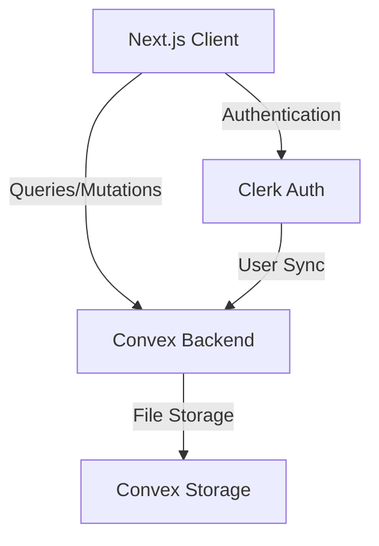
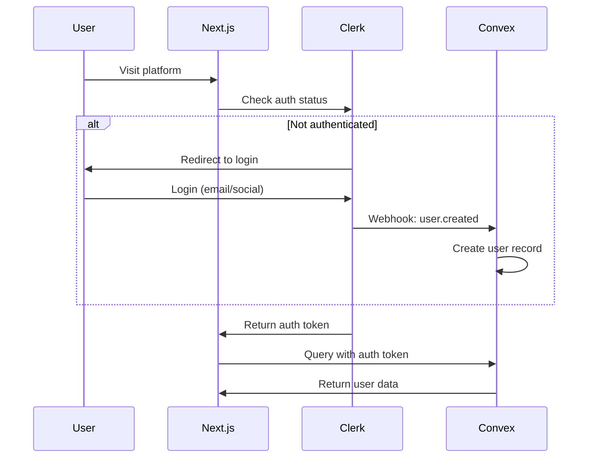
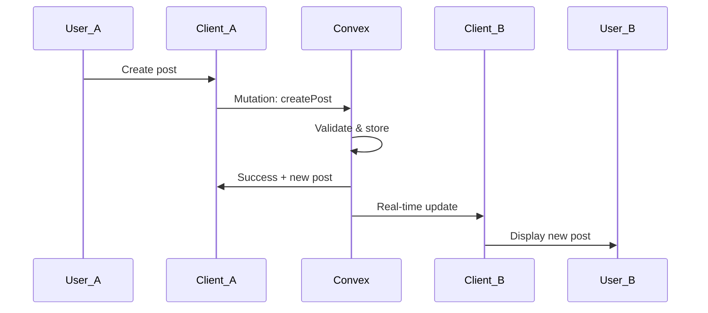

# Design Document: Campus Connect Foundation

## Overview

Campus Connect is a real-time academic social platform built with Next.js 14, Convex, and Clerk. This design document outlines the architecture, components, data models, and testing strategy for the foundation feature that establishes core functionality including authentication, user profiles, posts, and social interactions.

The platform leverages modern web technologies to provide a responsive, real-time experience:
- **Next.js 14 App Router** for server-side rendering and optimal performance
- **Convex** for real-time database with automatic synchronization
- **Clerk** for secure authentication with social login support
- **Tailwind CSS + shadcn/ui** for consistent, accessible UI components

## Architecture

### High-Level Architecture



### Application Structure

```
campus-connect/
├── app/                          # Next.js 14 App Router
│   ├── (auth)/                   # Auth routes (login, signup)
│   ├── (dashboard)/              # Protected routes
│   │   ├── feed/                 # Main feed page
│   │   ├── profile/[id]/         # User profile pages
│   │   ├── discover/             # User discovery
│   │   └── settings/             # User settings
│   ├── layout.tsx                # Root layout with providers
│   └── page.tsx                  # Landing page
├── components/                   # React components
│   ├── ui/                       # shadcn/ui components
│   ├── auth/                     # Auth-related components
│   ├── posts/                    # Post components
│   ├── profile/                  # Profile components
│   └── feed/                     # Feed components
├── convex/                       # Convex backend
│   ├── schema.ts                 # Database schema
│   ├── users.ts                  # User queries/mutations
│   ├── posts.ts                  # Post queries/mutations
│   ├── comments.ts               # Comment queries/mutations
│   ├── follows.ts                # Follow queries/mutations
│   └── http.ts                   # Clerk webhook handler
├── lib/                          # Utility functions
│   ├── utils.ts                  # General utilities
│   └── validations.ts            # Input validation schemas
└── hooks/                        # Custom React hooks
    ├── use-user.ts               # Current user hook
    └── use-theme.ts              # Theme management hook
```

### Authentication Flow



### Real-time Data Flow



## Components and Interfaces

### Frontend Components

#### Authentication Components

**SignInButton / SignUpButton**
- Purpose: Trigger Clerk authentication flows
- Props: None (uses Clerk components)
- Behavior: Opens Clerk modal for authentication

**UserButton**
- Purpose: Display user menu with profile and logout
- Props: None (uses Clerk component)
- Behavior: Shows avatar, opens menu on click

#### Profile Components

**ProfileForm**
- Purpose: Edit user profile information
- Props:
  - `initialData`: Current user profile data
  - `onSave`: Callback after successful save
- State: Form fields (name, bio, university, role, experienceLevel, socialLinks)
- Behavior: Validates input, calls Convex mutation on submit

**ProfileHeader**
- Purpose: Display user profile header with avatar and stats
- Props:
  - `user`: User object with profile data
  - `isOwnProfile`: Boolean indicating if viewing own profile
- Behavior: Shows follow button if not own profile

**SkillsManager**
- Purpose: Add/remove skills from profile
- Props:
  - `skills`: Array of current skills
  - `onUpdate`: Callback when skills change
- State: Input value for new skill
- Behavior: Validates skill input, prevents duplicates

#### Post Components

**PostComposer**
- Purpose: Create new posts
- Props:
  - `onPostCreated`: Callback after post creation
- State: Post content, character count
- Behavior: Validates content length, calls Convex mutation

**PostCard**
- Purpose: Display individual post with engagement options
- Props:
  - `post`: Post object with content and metadata
  - `author`: User object of post author
- Behavior: Shows like/comment buttons, handles engagement actions

**CommentList**
- Purpose: Display comments on a post
- Props:
  - `postId`: ID of the post
  - `comments`: Array of comment objects
- Behavior: Renders comments chronologically

**CommentComposer**
- Purpose: Add comments to posts
- Props:
  - `postId`: ID of the post to comment on
  - `onCommentAdded`: Callback after comment creation
- State: Comment text
- Behavior: Validates input, calls Convex mutation

#### Feed Components

**FeedContainer**
- Purpose: Display feed with infinite scroll
- Props: None (fetches data internally)
- State: Posts array, loading state, hasMore flag
- Behavior: Loads initial posts, fetches more on scroll

**InfiniteScrollTrigger**
- Purpose: Detect when user scrolls to bottom
- Props:
  - `onTrigger`: Callback when bottom reached
  - `hasMore`: Boolean indicating if more data available
- Behavior: Uses Intersection Observer API

#### Discovery Components

**UserSearchBar**
- Purpose: Search users by name
- Props:
  - `onSearch`: Callback with search query
- State: Search input value
- Behavior: Debounces input, triggers search

**UserFilterPanel**
- Purpose: Filter users by role and skills
- Props:
  - `onFilterChange`: Callback with filter criteria
- State: Selected role, selected skills
- Behavior: Updates filters, triggers search

**UserCard**
- Purpose: Display user in search results
- Props:
  - `user`: User object
- Behavior: Shows profile preview, links to full profile

### Backend Components (Convex)

#### Schema Definitions

**users table**
```typescript
{
  clerkId: string (indexed)
  email: string
  name: string
  profilePicture?: string
  bio?: string
  university?: string
  role: "Student" | "Research Scholar" | "Faculty"
  experienceLevel: "Beginner" | "Intermediate" | "Advanced" | "Expert"
  skills: string[]
  socialLinks: {
    github?: string
    linkedin?: string
    twitter?: string
    website?: string
  }
  followerCount: number
  followingCount: number
  createdAt: number
  updatedAt: number
}
```

**posts table**
```typescript
{
  authorId: Id<"users">
  content: string
  likeCount: number
  commentCount: number
  createdAt: number
  updatedAt: number
}
```

**likes table**
```typescript
{
  userId: Id<"users">
  postId: Id<"posts">
  createdAt: number
}
```
- Compound index on (userId, postId) for uniqueness

**comments table**
```typescript
{
  postId: Id<"posts">
  authorId: Id<"users">
  content: string
  createdAt: number
}
```

**follows table**
```typescript
{
  followerId: Id<"users">
  followingId: Id<"users">
  createdAt: number
}
```
- Compound index on (followerId, followingId) for uniqueness

#### Convex Functions

**users.ts**

`getCurrentUser()` - Query
- Returns: Current user object or null
- Auth: Required
- Behavior: Looks up user by Clerk ID from auth context

`getUserById(userId)` - Query
- Input: User ID
- Returns: User object or null
- Auth: Required
- Behavior: Fetches user by ID

`updateProfile(data)` - Mutation
- Input: Profile update object
- Returns: Updated user object
- Auth: Required
- Validation: Validates all fields, ensures user can only update own profile
- Behavior: Updates user record, sets updatedAt timestamp

`addSkill(skill)` - Mutation
- Input: Skill name string
- Returns: Updated skills array
- Auth: Required
- Validation: Non-empty, max 50 chars, no duplicates
- Behavior: Adds skill to user's skills array

`removeSkill(skill)` - Mutation
- Input: Skill name string
- Returns: Updated skills array
- Auth: Required
- Behavior: Removes skill from user's skills array

`searchUsers(query, filters)` - Query
- Input: Search query string, filter object (role, skills)
- Returns: Array of matching users
- Auth: Required
- Behavior: Searches by name, filters by role and skills

**posts.ts**

`getFeedPosts(limit, cursor)` - Query
- Input: Limit number, cursor for pagination
- Returns: Array of posts with author data, next cursor
- Auth: Required
- Behavior: Returns posts from followed users (or all if not following anyone), ordered by createdAt desc

`getPostById(postId)` - Query
- Input: Post ID
- Returns: Post object with author data
- Auth: Required
- Behavior: Fetches single post

`createPost(content)` - Mutation
- Input: Post content string
- Returns: New post object
- Auth: Required
- Validation: Non-empty, max 5000 chars
- Behavior: Creates post, initializes counts to 0

`deletePost(postId)` - Mutation
- Input: Post ID
- Returns: Success boolean
- Auth: Required
- Validation: User must be post author
- Behavior: Deletes post and associated likes/comments

**likes.ts**

`likePost(postId)` - Mutation
- Input: Post ID
- Returns: Success boolean
- Auth: Required
- Validation: Post exists, user hasn't already liked
- Behavior: Creates like record, increments post likeCount

`unlikePost(postId)` - Mutation
- Input: Post ID
- Returns: Success boolean
- Auth: Required
- Validation: Post exists, user has liked it
- Behavior: Deletes like record, decrements post likeCount

`hasUserLikedPost(postId)` - Query
- Input: Post ID
- Returns: Boolean
- Auth: Required
- Behavior: Checks if current user has liked the post

**comments.ts**

`getPostComments(postId)` - Query
- Input: Post ID
- Returns: Array of comments with author data
- Auth: Required
- Behavior: Fetches comments ordered by createdAt asc

`createComment(postId, content)` - Mutation
- Input: Post ID, comment content string
- Returns: New comment object
- Auth: Required
- Validation: Non-empty, max 1000 chars, post exists
- Behavior: Creates comment, increments post commentCount

**follows.ts**

`followUser(userId)` - Mutation
- Input: User ID to follow
- Returns: Success boolean
- Auth: Required
- Validation: User exists, not following self, not already following
- Behavior: Creates follow record, increments follower/following counts

`unfollowUser(userId)` - Mutation
- Input: User ID to unfollow
- Returns: Success boolean
- Auth: Required
- Validation: User exists, currently following
- Behavior: Deletes follow record, decrements follower/following counts

`isFollowing(userId)` - Query
- Input: User ID
- Returns: Boolean
- Auth: Required
- Behavior: Checks if current user follows specified user

`getFollowers(userId)` - Query
- Input: User ID
- Returns: Array of follower user objects
- Auth: Required
- Behavior: Fetches users who follow specified user

`getFollowing(userId)` - Query
- Input: User ID
- Returns: Array of following user objects
- Auth: Required
- Behavior: Fetches users that specified user follows

**http.ts**

`handleClerkWebhook(request)` - HTTP endpoint
- Input: Clerk webhook request
- Returns: HTTP response
- Auth: Webhook signature verification
- Behavior: Handles user.created and user.updated events, syncs to Convex

## Data Models

### User Model

```typescript
interface User {
  _id: Id<"users">
  clerkId: string
  email: string
  name: string
  profilePicture?: string
  bio?: string
  university?: string
  role: "Student" | "Research Scholar" | "Faculty"
  experienceLevel: "Beginner" | "Intermediate" | "Advanced" | "Expert"
  skills: string[]
  socialLinks: {
    github?: string
    linkedin?: string
    twitter?: string
    website?: string
  }
  followerCount: number
  followingCount: number
  createdAt: number
  updatedAt: number
}
```

**Invariants:**
- `clerkId` must be unique
- `email` must be valid email format
- `bio` max 500 characters
- `university` max 200 characters
- `role` must be one of the three defined values
- `experienceLevel` must be one of the four defined values
- `skills` array items max 50 characters each
- `followerCount` and `followingCount` must be non-negative
- `createdAt` and `updatedAt` must be valid timestamps

### Post Model

```typescript
interface Post {
  _id: Id<"posts">
  authorId: Id<"users">
  content: string
  likeCount: number
  commentCount: number
  createdAt: number
  updatedAt: number
}
```

**Invariants:**
- `authorId` must reference valid user
- `content` max 5000 characters
- `likeCount` must be non-negative
- `commentCount` must be non-negative
- `createdAt` and `updatedAt` must be valid timestamps

### Like Model

```typescript
interface Like {
  _id: Id<"likes">
  userId: Id<"users">
  postId: Id<"posts">
  createdAt: number
}
```

**Invariants:**
- `userId` must reference valid user
- `postId` must reference valid post
- Combination of (userId, postId) must be unique
- `createdAt` must be valid timestamp

### Comment Model

```typescript
interface Comment {
  _id: Id<"comments">
  postId: Id<"posts">
  authorId: Id<"users">
  content: string
  createdAt: number
}
```

**Invariants:**
- `postId` must reference valid post
- `authorId` must reference valid user
- `content` max 1000 characters
- `createdAt` must be valid timestamp

### Follow Model

```typescript
interface Follow {
  _id: Id<"follows">
  followerId: Id<"users">
  followingId: Id<"users">
  createdAt: number
}
```

**Invariants:**
- `followerId` must reference valid user
- `followingId` must reference valid user
- `followerId` must not equal `followingId` (cannot follow self)
- Combination of (followerId, followingId) must be unique
- `createdAt` must be valid timestamp

## Correctness Properties

*A property is a characteristic or behavior that should hold true across all valid executions of a system—essentially, a formal statement about what the system should do. Properties serve as the bridge between human-readable specifications and machine-verifiable correctness guarantees.*

### Authentication Properties

**Property 1: User record creation on authentication**
*For any* successful authentication event, a corresponding user record must exist in the database with the authenticated user's information.
**Validates: Requirements 1.5**

**Property 2: Protected route authorization**
*For any* protected route and any unauthenticated request, access must be denied and the user redirected to login.
**Validates: Requirements 1.7**

### Profile Management Properties

**Property 3: Default profile initialization**
*For any* newly created user, their profile must contain all required fields with appropriate default values (empty strings for optional text fields, default role and experience level).
**Validates: Requirements 2.1**

**Property 4: Profile data completeness**
*For any* user profile, all required fields (name, email, role, experienceLevel, skills, socialLinks, followerCount, followingCount) must be present in the stored record.
**Validates: Requirements 2.2**

**Property 5: Profile update persistence**
*For any* profile update operation, the changes must be immediately reflected in the database and retrievable in subsequent queries.
**Validates: Requirements 2.3**

**Property 6: Profile picture update**
*For any* profile picture upload, the profile's profilePicture field must be updated with the new image reference.
**Validates: Requirements 2.4**

**Property 7: Profile field validation**
*For any* profile update, the following validation rules must be enforced:
- Bio text must not exceed 500 characters
- University name must not exceed 200 characters
- Role must be one of: "Student", "Research Scholar", or "Faculty"
- Experience level must be one of: "Beginner", "Intermediate", "Advanced", or "Expert"
Invalid values must be rejected with appropriate error messages.
**Validates: Requirements 2.5, 2.6, 2.7, 2.8**

**Property 8: Profile visibility**
*For any* user viewing another user's profile, all public profile fields (name, profilePicture, bio, university, role, experienceLevel, skills, socialLinks, followerCount, followingCount) must be included in the response.
**Validates: Requirements 2.9**

### Skills Management Properties

**Property 9: Skill addition**
*For any* valid skill name added to a profile, the skill must appear in the user's skills array in subsequent queries.
**Validates: Requirements 3.1**

**Property 10: Skill removal**
*For any* skill removed from a profile, the skill must not appear in the user's skills array in subsequent queries.
**Validates: Requirements 3.2**

**Property 11: Skill validation**
*For any* skill addition, the following validation rules must be enforced:
- Skill name must not be empty
- Skill name must not exceed 50 characters
Invalid skills must be rejected with appropriate error messages.
**Validates: Requirements 3.3, 3.4**

**Property 12: Skill uniqueness**
*For any* skill that already exists in a user's profile, attempting to add it again must either be rejected or have no effect (skill appears only once).
**Validates: Requirements 3.5**

**Property 13: Skill display completeness**
*For any* user profile with skills, all skills in the skills array must be present in the rendered profile output.
**Validates: Requirements 3.6**

### Post Management Properties

**Property 14: Post creation**
*For any* authenticated user creating a post with valid content, a new post record must be created in the database with the user as the author.
**Validates: Requirements 4.1**

**Property 15: Post content validation**
*For any* post creation, the following validation rules must be enforced:
- Content must not be empty
- Content must not exceed 5000 characters
Invalid posts must be rejected with appropriate error messages.
**Validates: Requirements 4.2, 4.3**

**Property 16: Post data completeness**
*For any* created post, all required fields (authorId, content, likeCount, commentCount, createdAt, updatedAt) must be present in the stored record.
**Validates: Requirements 4.4**

**Property 17: Post initialization state**
*For any* newly created post, the likeCount must be 0 and commentCount must be 0.
**Validates: Requirements 4.5**

**Property 18: Post deletion**
*For any* post deleted by its author, the post must not be retrievable in subsequent queries.
**Validates: Requirements 4.6, 4.7**

### Post Engagement Properties

**Property 19: Like creation**
*For any* authenticated user liking a post they haven't previously liked, a like record must be created linking the user to the post.
**Validates: Requirements 5.1**

**Property 20: Like count increment**
*For any* post that is liked, the post's likeCount must increase by exactly 1.
**Validates: Requirements 5.2**

**Property 21: Like count decrement**
*For any* post that is unliked by a user who previously liked it, the post's likeCount must decrease by exactly 1.
**Validates: Requirements 5.3**

**Property 22: Like uniqueness**
*For any* user and post combination, at most one like record must exist. Attempting to like the same post multiple times must be rejected or have no additional effect.
**Validates: Requirements 5.4**

**Property 23: Comment creation**
*For any* authenticated user commenting on a post with valid content, a new comment record must be created in the database.
**Validates: Requirements 5.5**

**Property 24: Comment validation**
*For any* comment creation, the following validation rules must be enforced:
- Comment text must not be empty
- Comment text must not exceed 1000 characters
Invalid comments must be rejected with appropriate error messages.
**Validates: Requirements 5.6, 5.7**

**Property 25: Comment data completeness**
*For any* created comment, all required fields (postId, authorId, content, createdAt) must be present in the stored record.
**Validates: Requirements 5.8**

**Property 26: Comment chronological ordering**
*For any* post with multiple comments, the comments must be ordered by createdAt timestamp in ascending order (oldest first).
**Validates: Requirements 5.9**

### Feed Properties

**Property 27: Feed reverse chronological ordering**
*For any* feed query, posts must be ordered by createdAt timestamp in descending order (newest first).
**Validates: Requirements 6.1**

**Property 28: Feed filtering by follows**
*For any* user who follows one or more other users, the feed must contain only posts authored by those followed users.
**Validates: Requirements 6.3**

**Property 29: Feed post data completeness**
*For any* post displayed in the feed, all required display fields (author information, content, timestamp, likeCount, commentCount) must be present.
**Validates: Requirements 6.6**

### Following Properties

**Property 30: Follow creation**
*For any* authenticated user following another user (not themselves), a follow record must be created linking the follower to the followed user.
**Validates: Requirements 7.1**

**Property 31: Following list inclusion**
*For any* follow action, the followed user must appear in the follower's following list in subsequent queries.
**Validates: Requirements 7.2**

**Property 32: Unfollow removal**
*For any* authenticated user unfollowing a user they currently follow, the follow record must be removed from the database.
**Validates: Requirements 7.3**

**Property 33: Following list exclusion**
*For any* unfollow action, the unfollowed user must not appear in the follower's following list in subsequent queries.
**Validates: Requirements 7.4**

**Property 34: Self-follow prevention**
*For any* user attempting to follow themselves, the operation must be rejected with an appropriate error message.
**Validates: Requirements 7.5**

**Property 35: Follow count display**
*For any* user profile, both followerCount and followingCount must be present and accurately reflect the number of followers and following relationships.
**Validates: Requirements 7.6**

**Property 36: Follower and following list retrieval**
*For any* user profile, both the list of followers and the list of users being followed must be retrievable.
**Validates: Requirements 7.7**

### User Discovery Properties

**Property 37: User search by name**
*For any* name search query, all returned users must have names that match the query (case-insensitive substring match).
**Validates: Requirements 8.2**

**Property 38: User filter by role**
*For any* role filter, all returned users must have the specified role.
**Validates: Requirements 8.3**

**Property 39: User filter by skills**
*For any* skill filter, all returned users must have the specified skill in their skills array.
**Validates: Requirements 8.4**

**Property 40: Search result data completeness**
*For any* user in search results, all required display fields (profilePicture, name, role, university, skills) must be present.
**Validates: Requirements 8.6**

### Theme Properties

**Property 41: Theme persistence**
*For any* theme selection by a user, the selected theme must be retrievable in subsequent sessions.
**Validates: Requirements 10.2**

### Security Properties

**Property 42: XSS prevention**
*For any* text input containing potentially malicious content (script tags, event handlers, etc.), the content must be sanitized before storage and display.
**Validates: Requirements 12.3**

**Property 43: Authentication enforcement**
*For any* Convex mutation or query that accesses user data, unauthenticated requests must be rejected with an appropriate error.
**Validates: Requirements 12.4**

**Property 44: User authorization for modifications**
*For any* user attempting to modify (update or delete) profile data or posts, the operation must be rejected if the user is not the owner of that data.
**Validates: Requirements 12.5, 12.6**

**Property 45: Validation error messaging**
*For any* validation failure, a clear error message describing the validation issue must be returned to the user.
**Validates: Requirements 12.7**


## Error Handling

### Client-Side Error Handling

**Form Validation Errors**
- Display inline validation errors for form fields
- Show error messages below the relevant input field
- Prevent form submission until all validation passes
- Use red color and error icons for visual feedback

**Network Errors**
- Display toast notifications for failed API calls
- Provide retry buttons for transient failures
- Show loading states during operations
- Handle timeout scenarios gracefully

**Authentication Errors**
- Redirect to login page when session expires
- Display clear messages for authentication failures
- Handle OAuth callback errors appropriately
- Provide "Try Again" options for failed logins

### Server-Side Error Handling

**Validation Errors**
- Return 400 Bad Request with detailed error messages
- Include field-specific error information
- Use consistent error response format:
  ```typescript
  {
    error: string,
    field?: string,
    details?: string
  }
  ```

**Authorization Errors**
- Return 401 Unauthorized for unauthenticated requests
- Return 403 Forbidden for unauthorized actions
- Log authorization failures for security monitoring
- Never expose sensitive information in error messages

**Database Errors**
- Catch and handle Convex query/mutation failures
- Return 500 Internal Server Error for unexpected failures
- Log detailed error information for debugging
- Return generic error messages to clients

**Not Found Errors**
- Return 404 Not Found for non-existent resources
- Provide helpful error messages
- Suggest alternative actions (e.g., "User not found. Try searching again.")

### Error Recovery Strategies

**Optimistic Updates**
- Update UI immediately for better UX
- Revert changes if server operation fails
- Show error notification on failure
- Provide retry mechanism

**Graceful Degradation**
- Continue functioning when non-critical features fail
- Cache data locally when possible
- Queue operations for retry when offline
- Inform users of degraded functionality

**Connection Handling**
- Detect connection loss
- Show offline indicator
- Queue mutations for when connection returns
- Automatically reconnect and sync

## Testing Strategy

### Overview

The testing strategy employs a dual approach combining unit tests for specific examples and edge cases with property-based tests for universal correctness properties. This comprehensive approach ensures both concrete behavior validation and general correctness across all inputs.

### Property-Based Testing

**Framework Selection**
- **JavaScript/TypeScript**: Use `fast-check` library for property-based testing
- All property tests must run a minimum of 100 iterations to ensure comprehensive input coverage

**Property Test Implementation**
- Each correctness property from the design document must be implemented as a property-based test
- Each test must include a comment tag referencing the design property:
  ```typescript
  // Feature: campus-connect-foundation, Property 7: Profile field validation
  ```
- Tests should generate random valid and invalid inputs to verify properties hold across all cases

**Property Test Organization**
- Group property tests by feature area (authentication, profiles, posts, etc.)
- Place property tests in files named `*.property.test.ts`
- Run property tests as part of the standard test suite

**Example Property Test Structure**
```typescript
import fc from 'fast-check';

// Feature: campus-connect-foundation, Property 7: Profile field validation
describe('Profile field validation property', () => {
  it('should reject bio text exceeding 500 characters', () => {
    fc.assert(
      fc.property(
        fc.string({ minLength: 501, maxLength: 1000 }),
        async (longBio) => {
          const result = await updateProfile({ bio: longBio });
          expect(result.error).toBeDefined();
          expect(result.error).toContain('bio');
        }
      ),
      { numRuns: 100 }
    );
  });
});
```

### Unit Testing

**Framework Selection**
- **Frontend**: Jest + React Testing Library for component tests
- **Backend**: Convex test utilities for function tests

**Unit Test Focus Areas**
- Specific examples demonstrating correct behavior
- Edge cases (empty inputs, boundary values, special characters)
- Error conditions and validation failures
- Integration points between components
- UI component rendering and interactions

**Unit Test Organization**
- Co-locate tests with source files: `component.test.tsx` next to `component.tsx`
- Group tests by feature area
- Use descriptive test names that explain the scenario

**Example Unit Test Structure**
```typescript
describe('PostComposer', () => {
  it('should display error when post content is empty', async () => {
    render(<PostComposer />);
    const submitButton = screen.getByRole('button', { name: /post/i });
    
    fireEvent.click(submitButton);
    
    expect(await screen.findByText(/content is required/i)).toBeInTheDocument();
  });

  it('should create post with valid content', async () => {
    render(<PostComposer />);
    const textarea = screen.getByRole('textbox');
    const submitButton = screen.getByRole('button', { name: /post/i });
    
    fireEvent.change(textarea, { target: { value: 'Test post content' } });
    fireEvent.click(submitButton);
    
    await waitFor(() => {
      expect(mockCreatePost).toHaveBeenCalledWith({ content: 'Test post content' });
    });
  });
});
```

### Integration Testing

**Scope**
- Test complete user flows (e.g., create account → create post → like post)
- Verify Clerk authentication integration
- Test Convex real-time synchronization
- Validate end-to-end data flow

**Tools**
- Playwright or Cypress for E2E tests
- Test against local Convex development instance
- Use Clerk test mode for authentication

**Key Integration Test Scenarios**
- User registration and profile creation flow
- Post creation and engagement flow
- User discovery and following flow
- Theme switching and persistence
- Real-time updates across multiple clients

### Test Coverage Goals

**Minimum Coverage Targets**
- Unit test coverage: 80% of business logic
- Property tests: 100% of correctness properties implemented
- Integration tests: All critical user flows covered

**Coverage Exclusions**
- UI styling and layout (covered by visual regression tests)
- Third-party library code (Clerk, Convex)
- Configuration files

### Continuous Integration

**CI Pipeline**
- Run all unit tests on every commit
- Run property tests on every commit
- Run integration tests on pull requests
- Generate and publish coverage reports
- Fail builds if coverage drops below thresholds

**Test Performance**
- Unit tests should complete in < 30 seconds
- Property tests should complete in < 2 minutes
- Integration tests should complete in < 5 minutes
- Parallelize tests when possible

### Testing Best Practices

**Property Test Design**
- Generate diverse inputs covering edge cases
- Use appropriate generators for each data type
- Test both valid and invalid inputs
- Verify both success and failure paths

**Unit Test Design**
- Follow AAA pattern (Arrange, Act, Assert)
- Test one behavior per test
- Use descriptive test names
- Mock external dependencies
- Keep tests independent and isolated

**Test Maintenance**
- Update tests when requirements change
- Refactor tests to reduce duplication
- Keep test code quality high
- Document complex test scenarios
- Review test failures promptly
