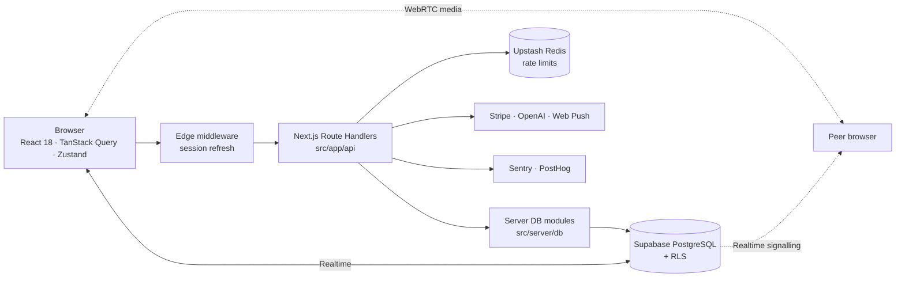

<div align="center">

# Campus Connect

### The all-in-one social and academic platform for college students

_Feed, chat, communities, events, jobs, Q&A and research in one place._

[](LICENSE)


[Quickstart](#quickstart) · [Features](#features) · [Architecture](#architecture) · [Methodology](./METHODOLOGY.md) · [Project status](#project-status) · [Documentation](#documentation) · [Report an issue](https://github.com/ArrinPaul/Campus-Connect/issues)

</div>

---

## About

Campus Connect is a full-stack web app that brings the parts of a student's online life into one platform: a social feed and messaging like Facebook and WhatsApp, communities like Discord, and professional networking like LinkedIn. It adds academic tools such as Q&A, shared resources and research collaboration.

Built with Next.js 14 (App Router) and Supabase. API route handlers handle the server logic, and Supabase provides PostgreSQL with Row Level Security, authentication, file storage and realtime updates.

**Who it's for:**
- **Students** connect with classmates, join communities, find project partners and mentors, ask and answer questions, share resources and apply for jobs.
- **Campus groups** run communities and events.
- **Admins** moderate content and manage users.

The project is under active development and **not yet production-ready**. See [Project status](#project-status) for what works, what's unfinished and what has never been run against a live database.

## Table of Contents

1. [About](#about)
2. [Features](#features)
3. [Tech stack](#tech-stack)
4. [Quickstart](#quickstart)
5. [Configuration](#configuration)
6. [Architecture](#architecture)
7. [Database](#database)
8. [API overview](#api-overview)
9. [Security](#security)
10. [Testing](#testing)
11. [Scripts](#scripts)
12. [Project structure](#project-structure)
13. [Project status](#project-status)
14. [Troubleshooting](#troubleshooting)
15. [Deployment](#deployment)
16. [Documentation](#documentation)
17. [Contributing](#contributing)
18. [License](#license)

## Features

| Area | What it includes |
| :--- | :--- |
| **Social** | Feed with infinite scroll, posts with a rich-text editor (code blocks and LaTeX math), polls, comments, reactions, reposts, bookmarks, hashtags, mentions, stories, follows, explore and search |
| **Messaging** | Direct and group conversations over realtime, typing indicators, presence, pinned messages, conversation roles, WebRTC audio and video calls |
| **Communities** | Create and join communities, member management, community settings and moderation |
| **Academic** | Q&A with answers, shared resource library with ratings, research papers and collaboration, course data |
| **Career** | Job and internship board, applications with poster-side review, project and portfolio sections on profiles |
| **Campus life** | Events, a marketplace with purchase requests, a leaderboard with reputation and gamification |
| **Discovery** | Find project partners and experts, people suggestions and weighted study-partner matching, and research search (keyword search today, embedding code present but not yet wired up) |
| **Platform** | Onboarding wizard, notifications center with Web Push, settings (profile, privacy, notifications, billing), subscriptions through Stripe, campus ads, an admin dashboard with user and moderation tools, installable PWA with an offline page |

## Tech stack

| Layer | Technology |
| :--- | :--- |
| Framework | Next.js 14 (App Router, Route Handlers, Edge middleware), React 18 |
| Language | TypeScript 5 (strict) |
| Styling and UI | Tailwind CSS 3, Radix UI primitives, Framer Motion, Lucide icons |
| Rich content | TipTap editor, KaTeX, react-markdown, highlight.js |
| Data and auth | Supabase: PostgreSQL with RLS, SSR Auth, Storage, Realtime |
| Client state | TanStack Query 5, TanStack Virtual, Zustand, React Hook Form |
| Validation | Zod 4 |
| Rate limiting | Upstash Redis, with an in-memory fallback |
| Observability | Sentry, PostHog |
| Testing | Jest 30, Testing Library, fast-check, Playwright |
| Hosting | Vercel |

## Quickstart

Prerequisites: Node.js 18.17+, npm, Git, and a [Supabase](https://supabase.com) project. For a local database you also need Docker Desktop and the [Supabase CLI](https://supabase.com/docs/guides/cli).

```bash
git clone https://github.com/ArrinPaul/Campus-Connect.git
cd Campus-Connect
npm install

cp .env.example .env.local
# fill in the three required Supabase variables (see Configuration)

npm run dev
```

Open <http://localhost:3000>.

### Set up the database

The schema is in `supabase/migrations/` (12 migration files). Apply it to your Supabase project, or run a local stack:

```bash
supabase start        # local Postgres, Auth, Storage, Realtime (needs Docker)
supabase db reset     # applies every migration from scratch (no seed data is included)
```

> Migrations `20240105` onward fix schema drift and add features such as marketplace transactions and resource ratings. Make sure **all** migrations are applied, or parts of the app will fail.

## Configuration

Copy `.env.example` to `.env.local` and never commit it.

**Required**

| Variable | Purpose |
| :--- | :--- |
| `NEXT_PUBLIC_SUPABASE_URL` | Supabase project URL |
| `NEXT_PUBLIC_SUPABASE_ANON_KEY` | Public anon key |
| `SUPABASE_SERVICE_ROLE_KEY` | Service-role key. **Server-only. Never expose it to the browser.** |

**Optional**

| Variable | Enables | Fallback when unset |
| :--- | :--- | :--- |
| `NEXT_PUBLIC_API_URL` | Frontend API base URL (default `http://localhost:3000`) | default |
| `CRON_SECRET` | Authorizes the `/api/cron/*` endpoints. It is **not** in `.env.example`. | Cron endpoints return `500` |
| `UPSTASH_REDIS_REST_URL`, `UPSTASH_REDIS_REST_TOKEN` | Edge rate limiting (120 requests per minute per IP on `/api/*`) | No rate limiting (the middleware logs a warning) |
| `OPENAI_API_KEY` | Query embeddings for research search. **Has no visible effect today**, because no paper embeddings are ever stored. | Mock embeddings |
| `STRIPE_SECRET_KEY`, `NEXT_PUBLIC_STRIPE_PUBLISHABLE_KEY`, `STRIPE_WEBHOOK_SECRET` | Paid subscriptions | Mock provider |
| `NEXT_PUBLIC_VAPID_PUBLIC_KEY`, `VAPID_PRIVATE_KEY`, `VAPID_SUBJECT` | Web Push notifications | Push disabled |
| `SENTRY_DSN`, `NEXT_PUBLIC_SENTRY_DSN`, `SENTRY_AUTH_TOKEN`, `SENTRY_ORG`, `SENTRY_PROJECT` | Error monitoring | Disabled |
| `NEXT_PUBLIC_POSTHOG_KEY`, `NEXT_PUBLIC_POSTHOG_HOST` | Product analytics | Disabled |

## Architecture



- **Pages** use the App Router. Route groups split the app into `(auth)`, `(onboarding)` and `(dashboard)`, and the dashboard has an `@modal` slot for intercepted post views.
- **API** routes under `src/app/api` call server-only modules in `src/server/db`, which talk to Supabase. The frontend uses a typed client in `src/lib/api.ts` built on TanStack Query.
- **Security** relies on Row Level Security in Postgres for data isolation, plus per-route auth checks and edge rate limiting. See [Security](#security).
- **Realtime** uses Supabase Realtime for the feed, notifications, chat and typing indicators, with reconnect backoff. Calls use WebRTC with Supabase Realtime for signalling.
- **Background work** runs through cron route handlers (`src/app/api/cron`: daily digest and suggestions sync).

## Database

The schema lives in `supabase/migrations/` (12 files). It defines 45 tables, and Row Level Security is enabled on every one of them.

| Domain | Tables |
| :--- | :--- |
| Profiles | `users`, `portfolio_projects`, `portfolio_certifications`, `skill_endorsements` |
| Social graph | `follows` |
| Content | `posts`, `comments`, `reactions`, `reposts`, `polls`, `poll_votes`, `bookmarks`, `hashtags`, `post_hashtags`, `stories`, `story_views` |
| Messaging | `conversations`, `conversation_participants`, `messages`, `presence`, `calls` |
| Communities | `communities`, `community_members`, `community_invites` |
| Events | `events`, `event_attendees` |
| Careers | `jobs`, `job_applications` |
| Marketplace | `marketplace_listings`, `marketplace_transactions` |
| Academic | `questions`, `question_answers`, `resources`, `resource_ratings`, `research_papers` |
| Engagement | `notifications`, `push_subscriptions`, `user_reputation`, `reputation_events` |
| Moderation | `content_reports` |
| Monetization | `subscriptions`, `subscription_events`, `ads` |
| Matching | `research_embeddings`, `user_interest_embeddings` (JSON arrays, not yet populated by any code) |

Migrations in order:

| Migration | Adds |
| :--- | :--- |
| `20240101` init | Core schema |
| `20240102` gamification | Reputation events |
| `20240103` push and subscriptions | Web Push subscriptions, Stripe subscriptions |
| `20240104` vector and recommendations | Embedding tables (JSON arrays, no pgvector column) |
| `20240105` frontend schema drift fixes | Columns the UI expected |
| `20240106` notifications policy | Tighter `notifications` insert policy |
| `20240107` realtime publication | Tables published to Supabase Realtime |
| `20240108` conversation roles, pinned messages | Roles and pinned messages |
| `20240109` polls | `is_anonymous` on polls |
| `20240110` users | `is_suspended` on users |
| `20240111` marketplace transactions | Purchase requests |
| `20240112` resource ratings | Ratings for resources |

> Per `docs/TASKS.md`, the fixes from `20240105` onward were written without database access and had not been applied to the live database when that file was last updated. Apply all migrations before testing features that depend on them.

## API overview

All endpoints are Next.js Route Handlers under `src/app/api`, about 184 route files in total. Most return JSON and require a signed-in user. The numbers below count route files per group.

| Group | Routes | Covers |
| :--- | :---: | :--- |
| `auth` | 4 | Sign-in, sign-up, sign-out |
| `users`, `skills`, `portfolio` | 9, 2, 3 | Profiles, skills, portfolio projects and certifications |
| `follows`, `graph`, `matching` | 6, 2, 2 | Follow graph, suggestions, partner and expert matching |
| `posts`, `comments`, `reactions`, `reposts`, `polls`, `bookmarks`, `hashtags`, `stories` | 10, 3, 4, 3, 3, 4, 4, 4 | Content and engagement |
| `conversations`, `messages`, `calls`, `presence` | 11, 5, 6, 2 | Chat, typing, WebRTC call signalling, online status |
| `communities` | 12 | Communities, members, invites, moderation |
| `events` | 6 | Events and attendance |
| `jobs` | 7 | Jobs and applications |
| `marketplace` | 11 | Listings and purchase requests |
| `questions`, `resources`, `research`, `courses` | 9, 6, 7, 1 | Q&A, shared resources, research papers |
| `leaderboard`, `reputation` | 1, 1 | Gamification |
| `notifications`, `push` | 4, 6 | In-app notifications and Web Push |
| `search` | 4 | Search across posts, people and hashtags |
| `subscriptions`, `ads` | 4, 7 | Stripe subscriptions, campus ads |
| `admin`, `reports` | 3, 1 | Stats, user management, moderation |
| `media` | 2 | Upload URLs and confirmation |
| `cron` | 2 | Daily digest and suggestions sync |
| `health`, `monitoring` | 2, 1 | Liveness and readiness, client error reports |

Five routes are still stubs that return `501`. See [Project status](#project-status).

## Security

What the code does today:

- **Row Level Security** is enabled on all 45 tables, and policies are bound to `auth.uid()`. There are about 138 `CREATE POLICY` statements across the migrations.
- **Authentication** uses Supabase Auth with SSR cookies. The Edge middleware refreshes the session and redirects unauthenticated visitors to `/sign-in`. About 143 route files check the signed-in user themselves.
- **Admin access.** Admin routes check `users.is_admin` and return an error for everyone else. Call accept, reject and end actions are limited to the call's participants.
- **Rate limiting.** When Upstash Redis is configured, the middleware limits every `/api/*` request to 120 per minute per IP and returns `429`. If Redis is unreachable it fails open.
- **Security headers** are set in `next.config.js`: a Content Security Policy, `X-Frame-Options: DENY`, HSTS with preload, `X-Content-Type-Options`, a referrer policy and a restrictive Permissions Policy.
- **Input handling.** Zod validation exists for a subset of write routes, and the post-creation route sanitizes content with `isomorphic-dompurify`.
- **Secrets.** `SUPABASE_SERVICE_ROLE_KEY` is used server-side only. Cron routes require `CRON_SECRET`, and the Stripe webhook checks a signature header.

Known gaps:

- **Rate limiting is off by default.** Without Upstash credentials the middleware does not limit requests at all.
- **Validation is uneven.** Zod covers only about 10 of the 184 route files, so many write routes rely on hand-written checks and RLS.
- **Credentials in git history.** `docs/ROADMAP.md` records that a Supabase service-role key and database password were once committed. They are no longer in the tree, but they remain in history. If they have not been rotated, rotate them.

Please report vulnerabilities privately to the maintainer, not in a public issue.

## Testing

```bash
npm test                 # Jest: unit, component and route tests
npm run type-check       # tsc --noEmit
npm run lint             # ESLint
npm run test:e2e         # Playwright end-to-end
```

**Jest** (jsdom, via `next/jest`) runs 82 suites and 696 tests. Tests sit next to the code (`*.test.ts(x)`) and in `src/tests/`, which holds route and feature tests for calls, marketplace, jobs, messaging, reputation, subscriptions, push, rate limiting, security and recommendations. Tests mock Supabase, so the suite does not need a database or network. Jest may print a "worker process has failed to exit gracefully" warning after the run, which comes from timers that tests leave open.

**Playwright** (`src/e2e/`) has specs for auth, feed, leaderboard, marketplace, messaging, notifications, profile and research, and runs in Chromium. Unlike Jest, it needs a running app wired to a real Supabase project, and the repo does not start one for you outside CI. Locally:

```bash
npx playwright install chromium
npm run dev              # in one terminal
npm run test:e2e         # in another
```

Set `PLAYWRIGHT_TEST_BASE_URL` to test a deployed URL. The e2e suite has not been run as part of this documentation pass.

## Scripts

| Command | What it does |
| :--- | :--- |
| `npm run dev` | Start the dev server on port 3000 |
| `npm run build` / `npm start` | Production build and server |
| `npm run lint` | ESLint |
| `npm run type-check` | `tsc --noEmit` |
| `npm test` | Jest unit and component tests |
| `npm run test:watch` | Jest in watch mode |
| `npm run test:e2e` | Playwright end-to-end tests (specs in `src/e2e/`) |

Latest local check: 82 Jest suites with 696 tests pass and `tsc --noEmit` is clean.

## Project structure

```text
Campus-Connect/
├── src/
│   ├── app/
│   │   ├── (auth)/          Sign-in and sign-up
│   │   ├── (onboarding)/    Profile onboarding wizard
│   │   ├── (dashboard)/     Feed, messages, communities, events, jobs, marketplace, Q&A,
│   │   │                    resources, research, stories, leaderboard, settings, admin, ...
│   │   ├── (components)/    Page-level components grouped by feature
│   │   ├── api/             Route handlers (about 184 route files)
│   │   └── offline/         PWA offline page
│   ├── components/          Shared feature components and ui/ primitives
│   ├── hooks/               Realtime, presence, typing, WebRTC, debounce hooks
│   ├── lib/                 Supabase clients, typed API client, auth, validation, rate limiter
│   ├── server/              db/, push/, recommendations/, subscriptions/
│   ├── e2e/                 Playwright specs
│   └── middleware.ts        Session and route protection
├── supabase/
│   ├── config.toml          Local Supabase configuration
│   └── migrations/          12 SQL migrations (about 45 tables, RLS policies)
├── METHODOLOGY.md           Ranking, matching, search and reputation algorithms
├── docs/                    Architecture, development, operations, roadmap, task list
├── scripts/                 Icon generation and migration helpers
└── public/                  Static assets and PWA icons
```

## Project status

Campus Connect is a **work in progress**. The code builds, type-checks and passes its tests, but several things are unfinished or unverified.

- **Never run against a live database.** According to `docs/TASKS.md`, migrations `20240105` to `20240112` had not been applied to the live database when last updated, and recent fixes have not been exercised in a browser or against live data.
- **Five API routes are still `501 Not Implemented` stubs:** `ads/update`, `media/confirm`, `messages/typing`, `monitoring/error` and `presence/status`.
- **Research search is keyword-only in practice.** The embedding code exists, but nothing stores paper embeddings, so semantic search always falls back to keywords. Details in [METHODOLOGY.md](METHODOLOGY.md#6-research-search).
- **Calls need a TURN server.** WebRTC calls across restrictive networks will not connect without one.
- **Payments are not real escrow.** The marketplace records purchase requests only. Stripe subscriptions fall back to a mock provider without keys.
- **No CI workflow is committed.** The repo has Dependabot configuration but no GitHub Actions workflow, so run lint, type-check and tests locally before merging.
- **Some documents are outdated.** `docs/PHASE_8_FINAL_REPORT.md` claims the app is "production certified". A later audit showed that is not true. Treat [`docs/ROADMAP.md`](docs/ROADMAP.md) and [`docs/TASKS.md`](docs/TASKS.md) as the source of truth.

## Troubleshooting

| Symptom | Likely cause | Fix |
| :--- | :--- | :--- |
| App crashes on start with a Supabase URL or key error | `.env.local` missing or the three required Supabase variables are empty | Copy `.env.example` to `.env.local`, fill in the values and restart `npm run dev`. |
| Pages show errors or empty data, or queries fail with "column does not exist" | Migrations not applied, especially `20240105` onward | Apply every file in `supabase/migrations/` (`supabase db reset` locally). |
| Feed, notifications or chat don't update live | Realtime publication not set up | Make sure migration `20240107` is applied and Realtime is enabled for your project. |
| `/api/cron/*` returns `500 CRON_SECRET is not configured` | `CRON_SECRET` is not set, and it is missing from `.env.example` | Set `CRON_SECRET` and send it as `Authorization: Bearer <secret>` or an `x-cron-secret` header. |
| An endpoint returns `501 Not Implemented` | One of the five unfinished stub routes | See [Project status](#project-status). `ads/update`, `media/confirm`, `messages/typing`, `monitoring/error` and `presence/status` are not implemented. |
| `429 Too many requests` | The Upstash edge limiter (120 requests per minute per IP) | Slow down, or unset the Upstash variables for local development. |
| No rate limiting in production | Upstash variables not set, so the middleware skips limiting | Set `UPSTASH_REDIS_REST_URL` and `UPSTASH_REDIS_REST_TOKEN`. |
| Admin pages refuse access | Your user's `is_admin` flag is false | Set `is_admin = true` for your row in the `users` table. |
| Calls don't connect across different networks | No TURN server is configured for WebRTC | Add a TURN server. See `docs/TASKS.md` §3. |
| Marketplace prices look 100 times too high | Older listings were stored in cents, and the app now uses dollars | Run `UPDATE marketplace_listings SET price = price / 100` once, only for listings created before the fix. |
| Jest fails with an ESM syntax error on a new markdown package | The package needs transforming | Add it to `transformIgnorePatterns` in `jest.config.js`. |
| `npm run test:e2e` fails to connect | The app isn't running | Start `npm run dev` first, or set `PLAYWRIGHT_TEST_BASE_URL`. |

## Deployment

The app is set up for [Vercel](https://vercel.com) (`vercel.json`: Next.js framework, `npm ci`, `npm run build`) with Supabase as the backend.

1. Create a Supabase project and apply every migration in `supabase/migrations/`.
2. Import the repo into Vercel and add the environment variables from [Configuration](#configuration).
3. Set up Upstash Redis for rate limiting, and Stripe, Sentry and PostHog if you want those features.
4. Deploy.

Operational guidance is in [`docs/OPERATIONS.md`](docs/OPERATIONS.md).

## Documentation

| Document | Purpose |
| :--- | :--- |
| [`METHODOLOGY.md`](METHODOLOGY.md) | How feed ranking, suggestions, matching, search and reputation work |
| [`docs/ROADMAP.md`](docs/ROADMAP.md) | Where the project stands and where it's going |
| [`docs/TASKS.md`](docs/TASKS.md) | Detailed checklist of fixes and remaining work |
| [`docs/SYSTEM_ARCHITECTURE.md`](docs/SYSTEM_ARCHITECTURE.md) | Architecture and database design |
| [`docs/DEVELOPMENT.md`](docs/DEVELOPMENT.md) | Developer setup, testing and workflow |
| [`docs/OPERATIONS.md`](docs/OPERATIONS.md) | Deployment, monitoring and incident response |
| [`docs/PROJECT_AUDIT.md`](docs/PROJECT_AUDIT.md) | Original page and route inventory |

## Contributing

Issues and pull requests are welcome. Branch from `main` using `feature/<name>`, `bugfix/<name>` or `chore/<name>`, and follow conventional commits (for example `feat: add realtime chat`, `fix: resolve RLS policy bug`). Before opening a PR, make sure `npm run lint`, `npm run type-check` and `npm test` all pass. Never commit `.env` files, API keys or database credentials.

## License

Released under the MIT License. See [LICENSE](LICENSE).
