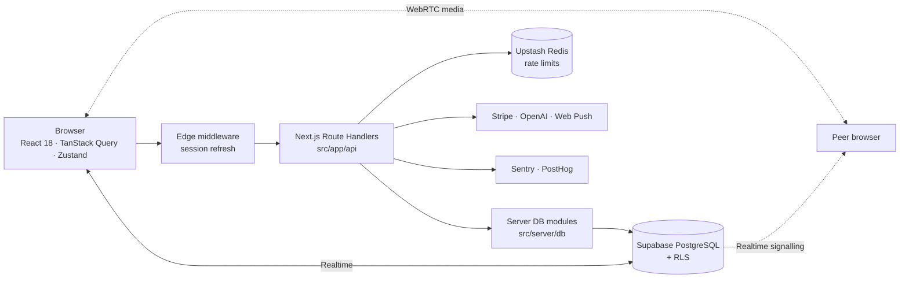

<div align="center">

# Campus Connect

### The all-in-one social and academic platform for college students

_Feed, chat, communities, events, jobs, Q&A and research in one place._

[](LICENSE)


[Quickstart](#quickstart) · [Features](#features) · [Architecture](#architecture) · [Project status](#project-status) · [Documentation](#documentation) · [Report an issue](https://github.com/ArrinPaul/Campus-Connect/issues)

</div>

---

## About

Campus Connect is a full-stack web app that brings the parts of a student's online life into one platform: a social feed and messaging like Facebook and WhatsApp, communities like Discord, and professional networking like LinkedIn. It adds academic tools such as Q&A, shared resources and research collaboration.

Built with Next.js 14 (App Router) and Supabase. API route handlers handle the server logic, and Supabase provides PostgreSQL with Row Level Security, authentication, file storage and realtime updates.

**Who it's for:**
- **Students** connect with classmates, join communities, find project partners and mentors, ask and answer questions, share resources and apply for jobs.
- **Campus groups** run communities and events.
- **Admins** moderate content and manage users.

The project is under active development and **not yet production-ready**. See [Project status](#project-status) for what works, what's unfinished and what has never been run against a live database.

## Table of Contents

1. [About](#about)
2. [Features](#features)
3. [Tech stack](#tech-stack)
4. [Quickstart](#quickstart)
5. [Configuration](#configuration)
6. [Architecture](#architecture)
7. [Scripts](#scripts)
8. [Project structure](#project-structure)
9. [Project status](#project-status)
10. [Deployment](#deployment)
11. [Documentation](#documentation)
12. [Contributing](#contributing)
13. [License](#license)

## Features

| Area | What it includes |
| :--- | :--- |
| **Social** | Feed with infinite scroll, posts with a rich-text editor (code blocks and LaTeX math), polls, comments, reactions, reposts, bookmarks, hashtags, mentions, stories, follows, explore and search |
| **Messaging** | Direct and group conversations over realtime, typing indicators, presence, pinned messages, conversation roles, WebRTC audio and video calls |
| **Communities** | Create and join communities, member management, community settings and moderation |
| **Academic** | Q&A with answers, shared resource library with ratings, research papers and collaboration, course data |
| **Career** | Job and internship board, applications with poster-side review, project and portfolio sections on profiles |
| **Campus life** | Events, a marketplace with purchase requests, a leaderboard with reputation and gamification |
| **Discovery** | Find project partners and experts, graph-based suggestions, optional semantic matching with OpenAI embeddings |
| **Platform** | Onboarding wizard, notifications center with Web Push, settings (profile, privacy, notifications, billing), subscriptions through Stripe, campus ads, an admin dashboard with user and moderation tools, installable PWA with an offline page |

## Tech stack

| Layer | Technology |
| :--- | :--- |
| Framework | Next.js 14 (App Router, Route Handlers, Edge middleware), React 18 |
| Language | TypeScript 5 (strict) |
| Styling and UI | Tailwind CSS 3, Radix UI primitives, Framer Motion, Lucide icons |
| Rich content | TipTap editor, KaTeX, react-markdown, highlight.js |
| Data and auth | Supabase: PostgreSQL with RLS, SSR Auth, Storage, Realtime; pgvector for embeddings |
| Client state | TanStack Query 5, TanStack Virtual, Zustand, React Hook Form |
| Validation | Zod 4 |
| Rate limiting | Upstash Redis, with an in-memory fallback |
| Observability | Sentry, PostHog |
| Testing | Jest 30, Testing Library, fast-check, Playwright |
| Hosting | Vercel |

## Quickstart

Prerequisites: Node.js 18.17+, npm, Git, and a [Supabase](https://supabase.com) project. For a local database you also need Docker Desktop and the [Supabase CLI](https://supabase.com/docs/guides/cli).

```bash
git clone https://github.com/ArrinPaul/Campus-Connect.git
cd Campus-Connect
npm install

cp .env.example .env.local
# fill in the three required Supabase variables (see Configuration)

npm run dev
```

Open <http://localhost:3000>.

### Set up the database

The schema is in `supabase/migrations/` (12 migration files). Apply it to your Supabase project, or run a local stack:

```bash
supabase start        # local Postgres, Auth, Storage, Realtime (needs Docker)
supabase db reset     # applies every migration from scratch (no seed data is included)
```

> Migrations `20240105` onward fix schema drift and add features such as marketplace transactions and resource ratings. Make sure **all** migrations are applied, or parts of the app will fail.

## Configuration

Copy `.env.example` to `.env.local` and never commit it.

**Required**

| Variable | Purpose |
| :--- | :--- |
| `NEXT_PUBLIC_SUPABASE_URL` | Supabase project URL |
| `NEXT_PUBLIC_SUPABASE_ANON_KEY` | Public anon key |
| `SUPABASE_SERVICE_ROLE_KEY` | Service-role key. **Server-only. Never expose it to the browser.** |

**Optional**

| Variable | Enables | Fallback when unset |
| :--- | :--- | :--- |
| `NEXT_PUBLIC_API_URL` | Frontend API base URL (default `http://localhost:3000`) | default |
| `UPSTASH_REDIS_REST_URL`, `UPSTASH_REDIS_REST_TOKEN` | Distributed rate limiting | In-memory limiter |
| `OPENAI_API_KEY` | Embeddings for semantic matching | Mock embeddings |
| `STRIPE_SECRET_KEY`, `NEXT_PUBLIC_STRIPE_PUBLISHABLE_KEY`, `STRIPE_WEBHOOK_SECRET` | Paid subscriptions | Mock provider |
| `NEXT_PUBLIC_VAPID_PUBLIC_KEY`, `VAPID_PRIVATE_KEY`, `VAPID_SUBJECT` | Web Push notifications | Push disabled |
| `SENTRY_DSN`, `NEXT_PUBLIC_SENTRY_DSN`, `SENTRY_AUTH_TOKEN`, `SENTRY_ORG`, `SENTRY_PROJECT` | Error monitoring | Disabled |
| `NEXT_PUBLIC_POSTHOG_KEY`, `NEXT_PUBLIC_POSTHOG_HOST` | Product analytics | Disabled |

## Architecture



- **Pages** use the App Router. Route groups split the app into `(auth)`, `(onboarding)` and `(dashboard)`, and the dashboard has an `@modal` slot for intercepted post views.
- **API** routes under `src/app/api` call server-only modules in `src/server/db`, which talk to Supabase. The frontend uses a typed client in `src/lib/api.ts` built on TanStack Query.
- **Security** relies on Row Level Security in Postgres for tenant isolation. Public write endpoints are rate-limited and request bodies are validated with Zod.
- **Realtime** uses Supabase Realtime for the feed, notifications, chat and typing indicators, with reconnect backoff. Calls use WebRTC with Supabase Realtime for signalling.
- **Background work** runs through cron route handlers (`src/app/api/cron`: daily digest and suggestions sync).

## Scripts

| Command | What it does |
| :--- | :--- |
| `npm run dev` | Start the dev server on port 3000 |
| `npm run build` / `npm start` | Production build and server |
| `npm run lint` | ESLint |
| `npm run type-check` | `tsc --noEmit` |
| `npm test` | Jest unit and component tests |
| `npm run test:watch` | Jest in watch mode |
| `npm run test:e2e` | Playwright end-to-end tests (specs in `src/e2e/`) |

Latest local check: 82 Jest suites with 696 tests pass and `tsc --noEmit` is clean.

## Project structure

```text
Campus-Connect/
├── src/
│   ├── app/
│   │   ├── (auth)/          Sign-in and sign-up
│   │   ├── (onboarding)/    Profile onboarding wizard
│   │   ├── (dashboard)/     Feed, messages, communities, events, jobs, marketplace, Q&A,
│   │   │                    resources, research, stories, leaderboard, settings, admin, ...
│   │   ├── (components)/    Page-level components grouped by feature
│   │   ├── api/             Route handlers (about 184 route files)
│   │   └── offline/         PWA offline page
│   ├── components/          Shared feature components and ui/ primitives
│   ├── hooks/               Realtime, presence, typing, WebRTC, debounce hooks
│   ├── lib/                 Supabase clients, typed API client, auth, validation, rate limiter
│   ├── server/              db/, push/, recommendations/, subscriptions/
│   ├── e2e/                 Playwright specs
│   └── middleware.ts        Session and route protection
├── supabase/
│   ├── config.toml          Local Supabase configuration
│   └── migrations/          12 SQL migrations (about 45 tables, RLS policies)
├── docs/                    Architecture, development, operations, roadmap, task list
├── scripts/                 Icon generation and migration helpers
└── public/                  Static assets and PWA icons
```

## Project status

Campus Connect is a **work in progress**. The code builds, type-checks and passes its tests, but several things are unfinished or unverified.

- **Never run against a live database.** According to `docs/TASKS.md`, migrations `20240105` to `20240112` had not been applied to the live database when last updated, and recent fixes have not been exercised in a browser or against live data.
- **Five API routes are still `501 Not Implemented` stubs:** `ads/update`, `media/confirm`, `messages/typing`, `monitoring/error` and `presence/status`.
- **Calls need a TURN server.** WebRTC calls across restrictive networks will not connect without one.
- **Payments are not real escrow.** The marketplace records purchase requests only. Stripe subscriptions fall back to a mock provider without keys.
- **No CI workflow is committed.** The repo has Dependabot configuration but no GitHub Actions workflow, so run lint, type-check and tests locally before merging.
- **Some documents are outdated.** `docs/PHASE_8_FINAL_REPORT.md` claims the app is "production certified". A later audit showed that is not true. Treat [`docs/ROADMAP.md`](docs/ROADMAP.md) and [`docs/TASKS.md`](docs/TASKS.md) as the source of truth.

## Deployment

The app is set up for [Vercel](https://vercel.com) (`vercel.json`: Next.js framework, `npm ci`, `npm run build`) with Supabase as the backend.

1. Create a Supabase project and apply every migration in `supabase/migrations/`.
2. Import the repo into Vercel and add the environment variables from [Configuration](#configuration).
3. Set up Upstash Redis for rate limiting, and Stripe, Sentry and PostHog if you want those features.
4. Deploy.

Operational guidance is in [`docs/OPERATIONS.md`](docs/OPERATIONS.md).

## Documentation

| Document | Purpose |
| :--- | :--- |
| [`docs/ROADMAP.md`](docs/ROADMAP.md) | Where the project stands and where it's going |
| [`docs/TASKS.md`](docs/TASKS.md) | Detailed checklist of fixes and remaining work |
| [`docs/SYSTEM_ARCHITECTURE.md`](docs/SYSTEM_ARCHITECTURE.md) | Architecture and database design |
| [`docs/DEVELOPMENT.md`](docs/DEVELOPMENT.md) | Developer setup, testing and workflow |
| [`docs/OPERATIONS.md`](docs/OPERATIONS.md) | Deployment, monitoring and incident response |
| [`docs/PROJECT_AUDIT.md`](docs/PROJECT_AUDIT.md) | Original page and route inventory |

## Contributing

Issues and pull requests are welcome. Branch from `main` using `feature/<name>`, `bugfix/<name>` or `chore/<name>`, and follow conventional commits (for example `feat: add realtime chat`, `fix: resolve RLS policy bug`). Before opening a PR, make sure `npm run lint`, `npm run type-check` and `npm test` all pass. Never commit `.env` files, API keys or database credentials.

## License

Released under the MIT License. See [LICENSE](LICENSE).
